# Themes

ai-bootstrap's look (the full-screen terminal interface, the GUI window and the line interface)
comes from a theme, written in a small CSS-like language. `/theme` lists the themes; `/theme NAME`
switches at once and keeps the choice for next time (in `theme.json` in the data folder).
`AIBOOT_THEME=NAME` picks one for a single run. `/screenshot [file.png]` saves the GUI window as a
PNG.

## Built-in themes

| theme       | what it is                                                      |
| ----------- | --------------------------------------------------------------- |
| `default`   | the original: a grey bot in bright blue boots, speaking cyan    |
| `solarized` | Solarized dark; fills the terminal with its background          |
| `phosphor`  | green phosphor on black: one colour, a soft glow and scan lines |
| `amber`     | phosphor's amber twin                                           |
| `synthwave` | neon pink and cyan over a purple dusk                           |
| `paper`     | ink on warm paper, for daylight; a serif voice in the GUI       |
| `comic`     | a big speech balloon, halftone dots, and Comic Sans, proudly    |
| `mono`      | no colour at all: bold, italic, underline and dim do the work   |

|                                             |                                             |
| ------------------------------------------- | ------------------------------------------- |
| 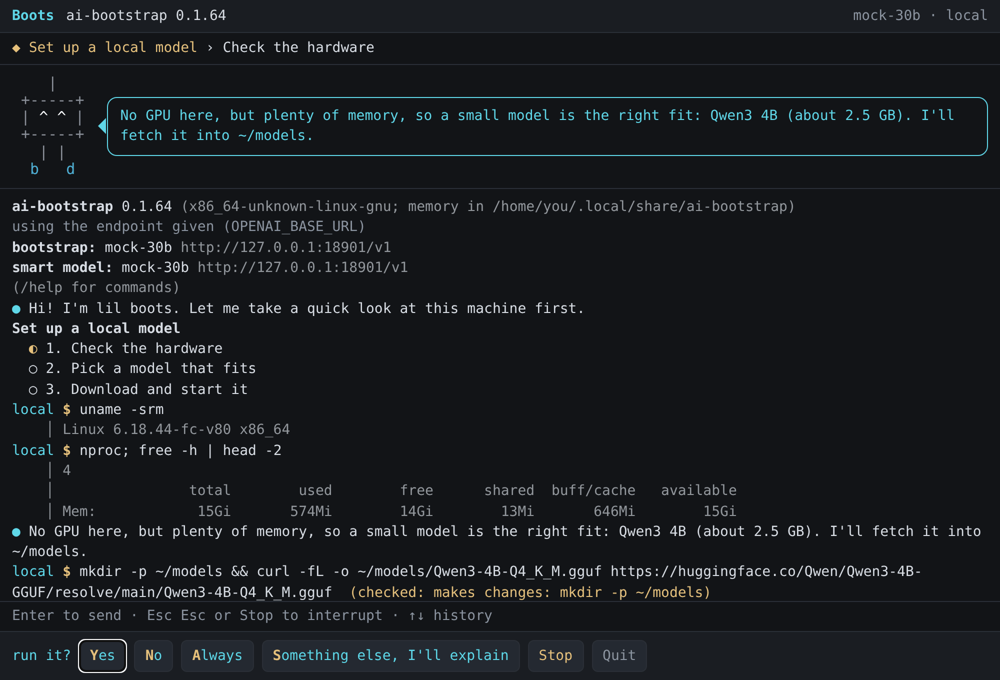     | 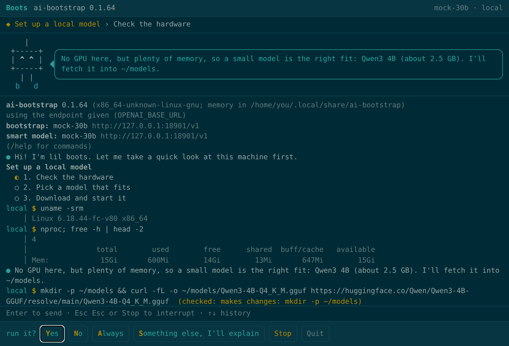 |
| 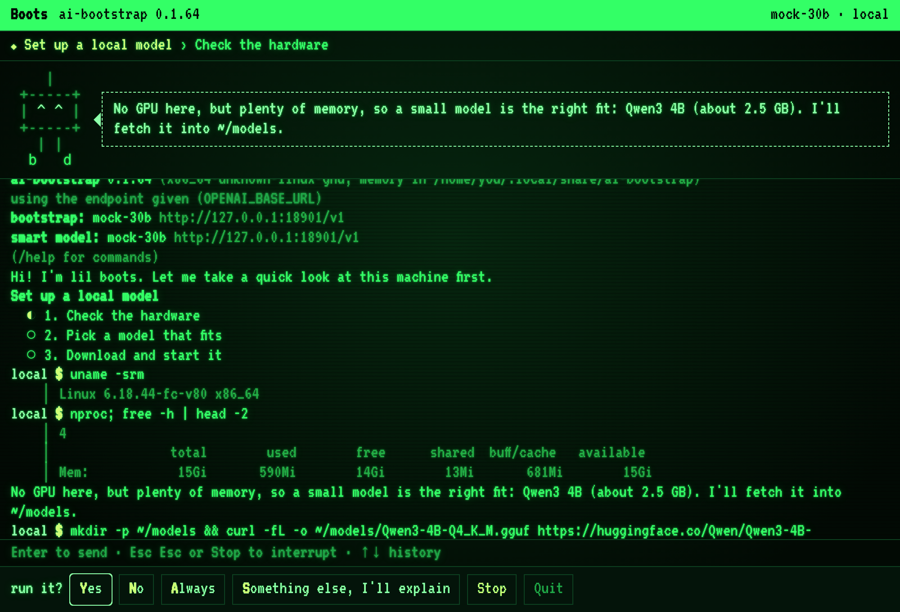   | 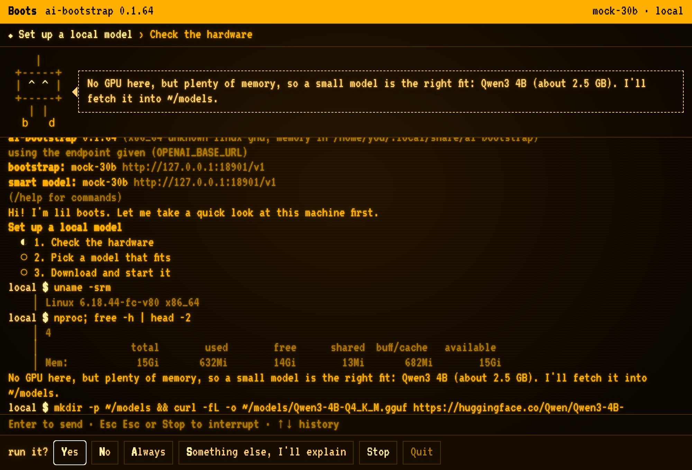         |
| 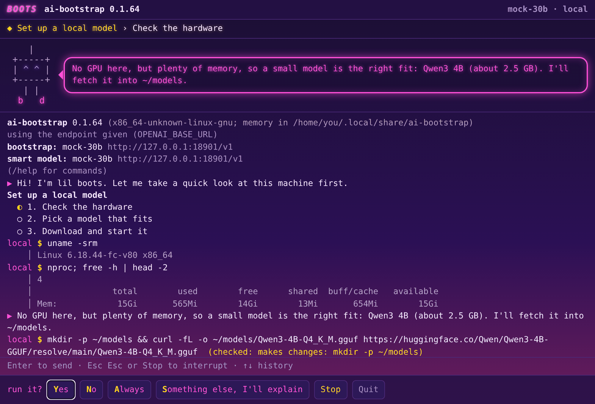 | 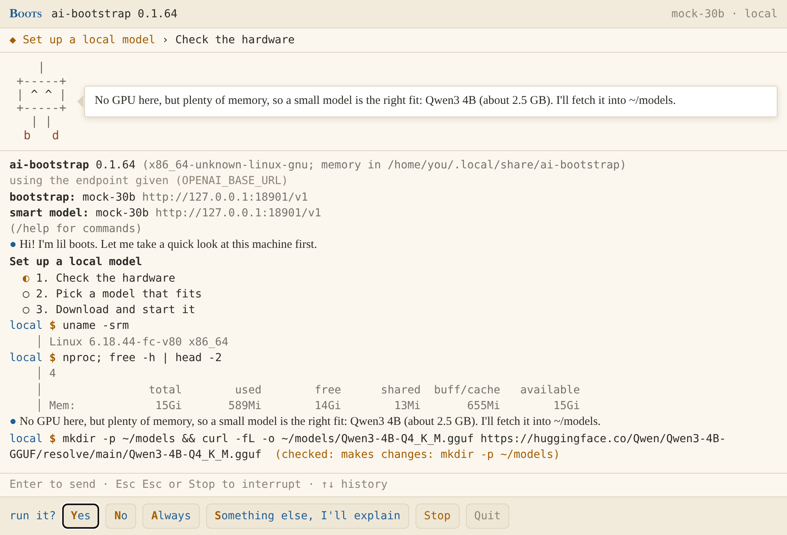         |
| 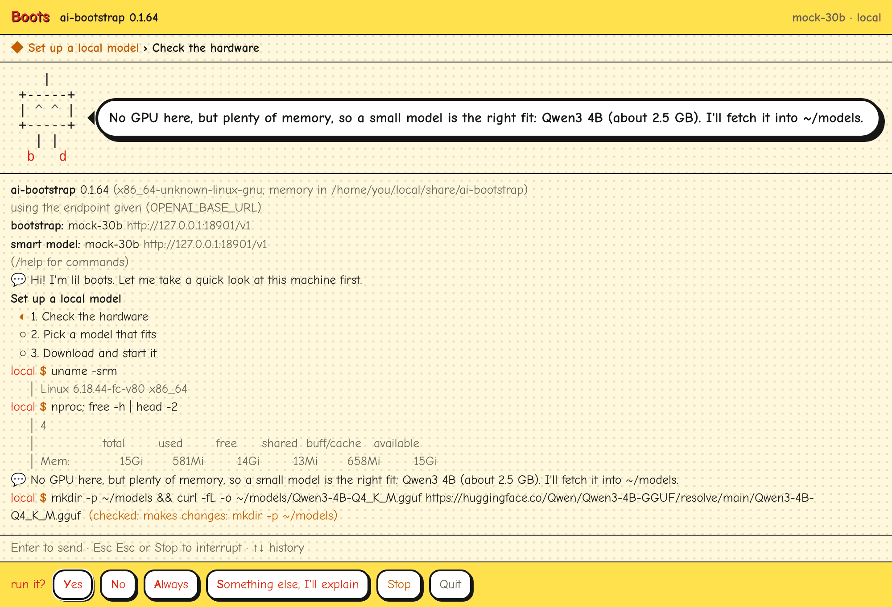         | 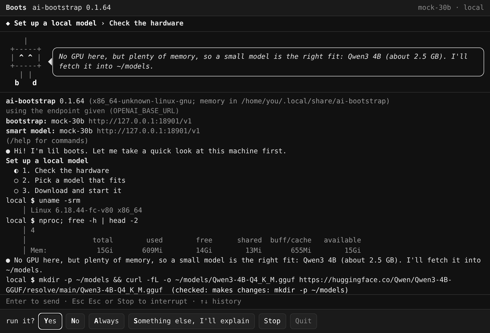           |

In a terminal (`--tui`):

|                                             |                                           |
| ------------------------------------------- | ----------------------------------------- |
| 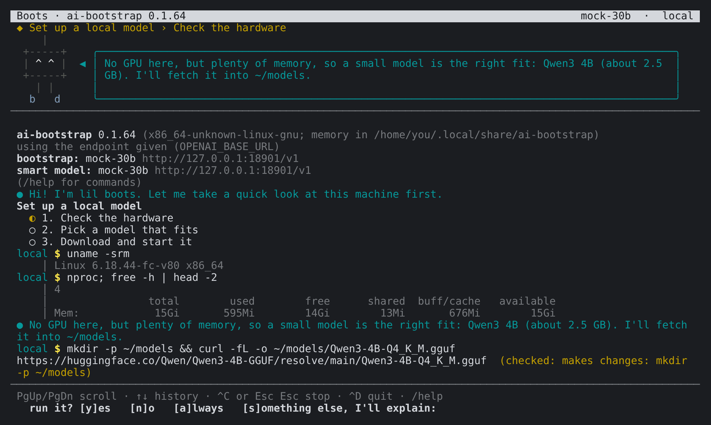     | 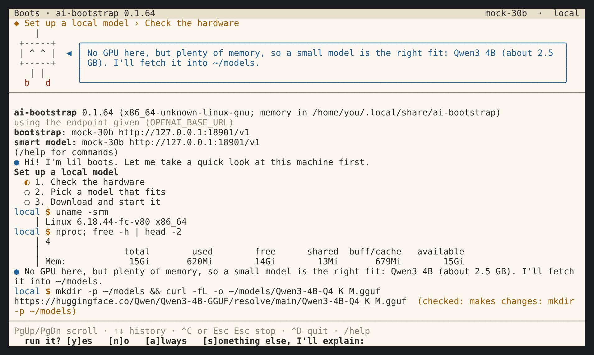       |
| 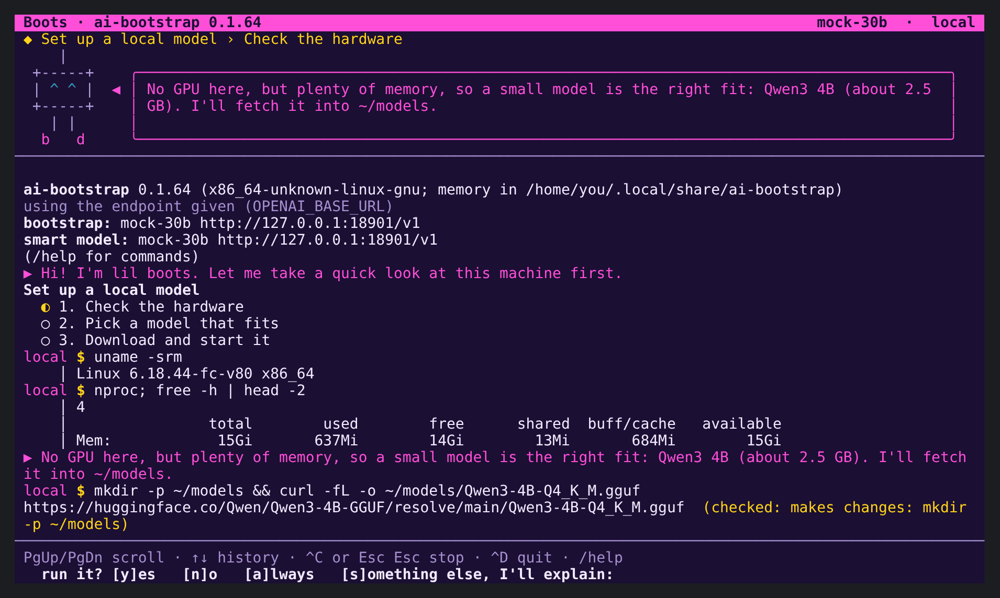 | 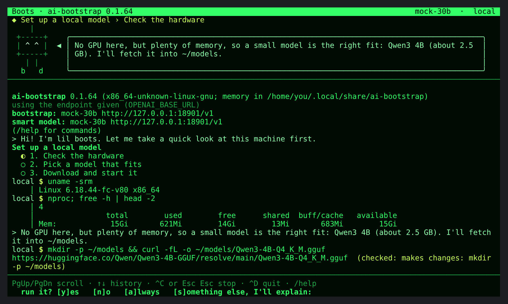 |

## Your own theme

Put `NAME.css` in the `themes` folder of the data folder (`/theme` prints where that is, e.g.
`~/.local/share/ai-bootstrap/themes` on Linux), then `/theme NAME`. It is read again each time you
switch to it, so edit, `/theme NAME`, look, repeat. Anything it cannot read is reported when you
switch, and left out.

Most themes start from another and change its custom properties:

```css
/* Ocean: deep blue, sea-green speech. */
@extends default;
@description "deep blue, sea-green speech";

:root {
  --text: #cfe3f0;
  --bg: #0b2233;
  --faint: #6f8fa6;
  --dimming: 1;
  --accent: #3fd0b0;
  --warn: #f2c14e;
  --error: #ff6b6b;
  --ok: #8be28b;
  --boots: #3fd0b0;
  --header-bg: #123349;
  --header-fg: #cfe3f0;
  --header-inverse: off;
}

@media gui {
  :root {
    --panel: #0f2b40;
    --line: #1d4460;
    --button: #123349;
  }
  bubble {
    border: 2px solid var(--accent);
    border-radius: 18px;
  }
  assistant {
    font-family: Georgia, serif;
  }
}
```

## The language

- **Rules**: `role, role { property: value; ... }`. Roles are listed below; a rule for several roles
  is a comma list. Comments are `/* ... */`.
- **Custom properties**: `:root { --name: value; }`, used as `var(--name)` or
  `var(--name, fallback)`, anywhere in a value.
- **`@extends NAME;`** starts from another theme (built in or yours); its rules come first, yours
  override them property by property. `default` is the usual start: its properties are
  `--text --bg --faint --dimming --accent --warn --error --ok --user --blue --magenta --body --eyes
  --boots --sweat --signal --header-fg --header-bg --header-inverse`,
  and for the GUI also `--panel --line --button --font --radius --say-gap` (the space around the
  model's words).
- **`@description "...";`** is what `/theme` shows.
- **`@media tui { ... }`** and **`@media gui { ... }`** hold rules for one of them only. The line
  interface reads the `tui` rules too.

### Colours

`#rgb`, `#rrggbb`, `rgb(r, g, b)`, the terminal's sixteen
(`black red green yellow blue magenta cyan
white`, `grey`, and `bright-red` ... `bright-white`),
common CSS names (`orange`, `hotpink`, `teal`, ...), and `default` for the terminal's own colour (in
the GUI: no colour set). In a terminal, the sixteen names use its own palette; other colours are
24-bit where the terminal says it can (`COLORTERM=truecolor`, Windows Terminal, iTerm2, WezTerm, VS
Code, Ghostty) and the nearest of 256 otherwise.

### Properties

The terminal reads:

| property                         | effect                                         |
| -------------------------------- | ---------------------------------------------- |
| `color`                          | the text colour                                |
| `background`, `background-color` | the background (for `text`: the whole screen)  |
| `font-weight: bold`              | bold (`lighter`: dim)                          |
| `font-style: italic`             | italic                                         |
| `text-decoration: underline`     | underline (`line-through` too)                 |
| `opacity` below 1                | dim                                            |
| `inverse: on`                    | swapped colours (terminal only)                |
| `content: "..."`                 | for `assistant.mark` and `user.mark`: the mark |

When a value holds more than a colour (`border: 2px solid #f0f`, a gradient), the terminal takes the
first colour in it. The bubble's frame takes its `border-color` (or the colour in `border`).

The GUI reads every CSS property: borders, `border-radius`, `box-shadow`, `text-shadow`,
`font-family`, `font-size`, gradients and images as `background`, `letter-spacing`,
`text-transform`, and so on. Nothing with `<`, `>`, `{` or `}` in it is used.

### Roles

| role                                                             | what it styles                                                                                                   |
| ---------------------------------------------------------------- | ---------------------------------------------------------------------------------------------------------------- |
| `:root`                                                          | custom properties                                                                                                |
| `text`                                                           | everything: text colour, background, font                                                                        |
| `panel`                                                          | the header and input bars (GUI)                                                                                  |
| `header`, `header.name`, `header.where`                          | the title bar; the bot's name and the model (GUI)                                                                |
| `goal`, `goal.step`, `goal.more`                                 | the current goal under the title; its step; the count                                                            |
| `bot`                                                            | the bot as a whole (GUI: its font and size)                                                                      |
| `bot.body`, `bot.eyes`, `bot.boots`                              | the bot's parts                                                                                                  |
| `bot.sweat`, `bot.signal`                                        | the drops while it works; the antenna when it signals                                                            |
| `bubble`, `bubble.tail`                                          | the speech bubble; its pointer                                                                                   |
| `rule`                                                           | the lines between the parts (GUI: border colour)                                                                 |
| `log`                                                            | the transcript area                                                                                              |
| `assistant`, `assistant.mark`                                    | the model's words; the mark before them                                                                          |
| `user`, `user.mark`                                              | what you typed; the mark before it                                                                               |
| `dim`, `info`, `warn`, `error`, `ok`, `bold`                     | the kinds of transcript lines                                                                                    |
| `red` `green` `yellow` `blue` `magenta` `cyan`                   | those colours in lines: where a command runs (cyan), `$` (yellow), root's `#` (red), an ssh hop's `>>` (magenta) |
| `status`, `spinner`                                              | the status line; its spinner                                                                                     |
| `prompt`                                                         | the prompt or question                                                                                           |
| `input`, `input.focus`                                           | the input box (GUI); while typing                                                                                |
| `button`, `button.hover`, `choice`, `choice.key`, `stop`, `quit` | the GUI's buttons                                                                                                |

## Screenshots

`/screenshot` (with `--gui`) saves the window as `boots-YYYYMMDD-HHMMSS.png` in the current folder,
or where you say: `/screenshot ~/Desktop/boots.png`. The page draws itself into the PNG at the
screen's pixel density, so what you see is what you get, scroll position and all.
